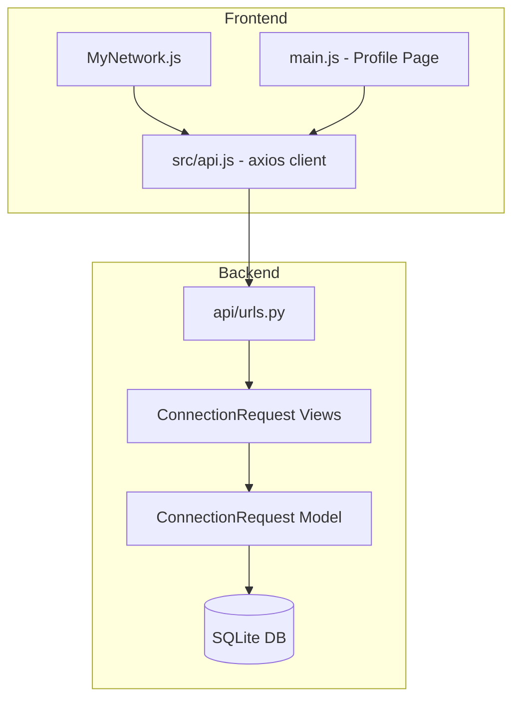
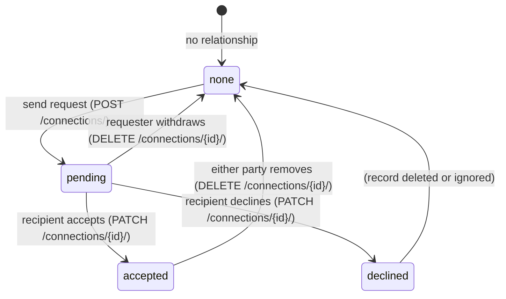

# Design Document: Profile Connections

## Overview

This feature adds a LinkedIn-style connections system to the existing LinkedIn clone. It introduces a `ConnectionRequest` model on the backend, a set of REST API endpoints for managing the full connection lifecycle, and UI updates to `src/MyNetwork.js` and `src/main.js` (Profile Page).

The system supports: sending requests, accepting/declining, withdrawing pending requests, removing accepted connections, viewing connection count and list on the profile, and showing per-user connection status in the MyNetwork page.

The backend is Django REST Framework with JWT authentication. The frontend is React using the existing `src/api.js` axios client.

---

## Architecture



### Request Lifecycle



---

## Components and Interfaces

### Backend Components

**`ConnectionRequest` Model** — stores the request record with `requester`, `recipient`, `status`, and `created_at`.

**`ConnectionRequestSerializer`** — serializes the model for API responses, including nested user info.

**`ConnectionStatusSerializer`** — lightweight serializer for the status-check endpoint.

**Views:**
- `ConnectionRequestListCreateView` — `GET /connections/` (list own requests), `POST /connections/` (send request)
- `ConnectionRequestDetailView` — `PATCH /connections/{id}/` (accept/decline), `DELETE /connections/{id}/` (withdraw/remove)
- `connection_status` — `GET /connections/status/{user_id}/` (get status between current user and another)
- `connection_count` — `GET /connections/count/` (get accepted connection count for current user)
- `connections_list` — `GET /connections/list/` (get list of accepted connections for current user)

### Frontend Components

**`src/api.js` additions:**
- `sendConnectionRequest(userId)` — POST
- `respondToConnection(id, action)` — PATCH with `{status: 'accepted'|'declined'}`
- `withdrawConnection(id)` — DELETE
- `removeConnection(id)` — DELETE
- `fetchConnectionStatus(userId)` — GET status for a single user
- `fetchConnectionCount()` — GET count
- `fetchConnectionsList()` — GET list of connections

**`src/MyNetwork.js` changes:**
- Fetch real connection statuses for all displayed users on load
- Replace the local `connected` state toggle with real API calls
- Render buttons based on `Connection_Status`: `none` → Connect, `pending_sent` → Pending, `pending_received` → Accept + Decline, `connected` → Connected

**`src/main.js` (Profile Page) changes:**
- Add a "Connections" section showing count and list of accepted connections
- Fetch count and list on mount
- Show skeleton/placeholder while loading, fallback to "0 connections" on error

---

## Data Models

### `ConnectionRequest`

```python
class ConnectionRequest(models.Model):
    STATUS_CHOICES = [
        ('pending', 'Pending'),
        ('accepted', 'Accepted'),
        ('declined', 'Declined'),
    ]
    requester = models.ForeignKey(User, on_delete=models.CASCADE, related_name='sent_requests')
    recipient = models.ForeignKey(User, on_delete=models.CASCADE, related_name='received_requests')
    status = models.CharField(max_length=10, choices=STATUS_CHOICES, default='pending')
    created_at = models.DateTimeField(auto_now_add=True)

    class Meta:
        unique_together = ('requester', 'recipient')
        ordering = ['-created_at']

    def __str__(self):
        return f"{self.requester} -> {self.recipient} ({self.status})"
```

The `unique_together` constraint on `(requester, recipient)` enforces that only one request can exist between any ordered pair of users. The API layer additionally checks for the reverse direction to prevent duplicates in either direction.

### API Response Shapes

**Connection Request object:**
```json
{
  "id": 1,
  "requester": { "id": 2, "username": "alice", "first_name": "Alice", "last_name": "Smith" },
  "recipient": { "id": 3, "username": "bob", "first_name": "Bob", "last_name": "Jones" },
  "status": "pending",
  "created_at": "2024-01-15T10:30:00Z"
}
```

**Connection Status response:**
```json
{
  "status": "pending_sent",
  "connection_id": 1
}
```
`connection_id` is `null` when status is `none`.

**Connection Count response:**
```json
{ "count": 42 }
```

**Connections List item:**
```json
{
  "id": 3,
  "username": "bob",
  "first_name": "Bob",
  "last_name": "Jones",
  "avatar": "/media/avatars/bob.jpg"
}
```

---

## Correctness Properties

*A property is a characteristic or behavior that should hold true across all valid executions of a system — essentially, a formal statement about what the system should do. Properties serve as the bridge between human-readable specifications and machine-verifiable correctness guarantees.*

### Property 1: No self-connections

*For any* authenticated user, sending a connection request to themselves SHALL be rejected with HTTP 400.

**Validates: Requirements 1.2**

### Property 2: No duplicate connection requests

*For any* pair of users (A, B), if a ConnectionRequest already exists between them in any status, sending another request in either direction SHALL be rejected with HTTP 400.

**Validates: Requirements 1.3**

### Property 3: Authorization — only authorized actors can mutate a request

*For any* ConnectionRequest and any user who is neither the requester nor the recipient, attempting to accept, decline, withdraw, or remove that request SHALL return HTTP 403. Additionally, the recipient cannot withdraw (only the requester can), and the requester cannot accept/decline (only the recipient can).

**Validates: Requirements 2.3, 6.2, 7.2**

### Property 4: Connection count equals accepted connections

*For any* user, the value returned by `GET /connections/count/` SHALL equal the number of ConnectionRequest records where that user is either requester or recipient and status is `accepted`.

**Validates: Requirements 3.1**

### Property 5: Connection list matches accepted records

*For any* user, the list returned by `GET /connections/list/` SHALL contain exactly the set of users who share an accepted ConnectionRequest with the authenticated user — no more, no less.

**Validates: Requirements 4.1**

### Property 6: Status endpoint is consistent with records

*For any* pair of users (A, B), the status returned by `GET /connections/status/{B_id}/` when called by A SHALL accurately reflect the current state of the ConnectionRequest record between them: `none` if no record exists, `pending_sent` if A is requester and status is pending, `pending_received` if A is recipient and status is pending, `connected` if status is accepted.

**Validates: Requirements 5.1**

### Property 7: Accept/decline lifecycle transitions

*For any* pending ConnectionRequest, after the recipient accepts it the status SHALL be `accepted` and the response SHALL be HTTP 200; after the recipient declines it the status SHALL be `declined` and the response SHALL be HTTP 200.

**Validates: Requirements 2.1, 2.2**

### Property 8: Withdraw and remove delete the record

*For any* ConnectionRequest, after a successful withdraw (by requester on a pending request) or remove (by either party on an accepted connection), the record SHALL no longer exist in the database and the response SHALL be HTTP 204.

**Validates: Requirements 6.1, 7.1**

### Property 9: Connection count decrements on removal

*For any* user with at least one accepted connection, after removing one of those connections the count returned by `GET /connections/count/` SHALL be exactly one less than before the removal.

**Validates: Requirements 7.4**

### Property 10: UI status-to-button-state mapping

*For any* user displayed in the MyNetwork page, the rendered button state SHALL correspond exactly to the Connection_Status: `none` → "Connect" button, `pending_sent` → "Pending" (non-interactive), `pending_received` → "Accept" and "Decline" buttons, `connected` → "Connected" (non-interactive).

**Validates: Requirements 1.4, 2.4, 5.3, 5.4, 5.5, 5.6**

### Property 11: UI button state updates after action

*For any* user card in the MyNetwork page, after performing a connection action (connect, accept, decline, withdraw, remove), the button state SHALL immediately reflect the new Connection_Status without a full page reload.

**Validates: Requirements 1.5, 2.5, 2.6, 6.3, 7.3**

### Property 12: Profile connections list renders name and avatar

*For any* list of accepted connections returned by the API, the Profile Page SHALL render each connection's name and avatar in the Connections section.

**Validates: Requirements 4.4**

---

## Error Handling

| Scenario | HTTP Status | Response |
|---|---|---|
| Send request to self | 400 | `{"error": "You cannot connect with yourself."}` |
| Duplicate request | 400 | `{"error": "A connection request already exists between these users."}` |
| Non-recipient tries accept/decline | 403 | `{"error": "You are not the recipient of this request."}` |
| Non-requester tries withdraw | 403 | `{"error": "You are not the requester of this request."}` |
| Non-participant tries remove | 403 | `{"error": "You are not part of this connection."}` |
| Request not found | 404 | `{"error": "Not found."}` |
| Unauthenticated access | 401 | DRF default JWT 401 |
| Connection count fetch fails (frontend) | — | Display "0 connections" fallback |
| Connection list fetch fails (frontend) | — | Display empty list with error message |

---

## Testing Strategy

### Unit Tests (Django `tests.py`)

Focus on specific examples and edge cases:

- Sending a request to self returns 400
- Sending a duplicate request returns 400
- Non-recipient cannot accept/decline (403)
- Non-requester cannot withdraw (403)
- Non-participant cannot remove (403)
- Accepting a request sets status to `accepted` and returns 200
- Declining a request sets status to `declined` and returns 200
- Withdrawing a pending request deletes the record and returns 204
- Removing an accepted connection deletes the record and returns 204
- Count endpoint returns correct integer
- List endpoint returns correct users
- Status endpoint returns correct status string for each of the four states (`none`, `pending_sent`, `pending_received`, `connected`)
- Profile page shows "0 connections" when count fetch fails (frontend unit test)
- Profile page shows empty state message when connections list is empty (frontend unit test)

### Property-Based Tests

Use **Hypothesis** (Python property-based testing library) for the backend. Use **jest-fast-check** or **@fast-check/jest** for React frontend property tests.

Each property test runs a minimum of **100 iterations**.

Tag format: `# Feature: profile-connections, Property {N}: {property_text}`

**Property test mapping:**

- **Property 1** — Generate random users; call send-request to self → always 400
- **Property 2** — Generate random user pairs; create a request; attempt a second request in either direction → always 400
- **Property 3** — Generate random requests and random third-party users; attempt accept/decline/withdraw/remove as unauthorized actor → always 403
- **Property 4** — Generate random sets of accepted/pending/declined requests for a user; count endpoint result equals the number of accepted records involving that user
- **Property 5** — Generate random accepted connections for a user; list endpoint returns exactly the expected set of user IDs
- **Property 6** — Generate random connection states between user pairs; status endpoint returns the correct status string for each state
- **Property 7** — Generate random pending requests; accept → status `accepted` + 200; decline → status `declined` + 200
- **Property 8** — Generate random requests; withdraw (pending, by requester) or remove (accepted, by either party) → record deleted + 204
- **Property 9** — Generate random users with at least one accepted connection; remove one → count decrements by exactly 1
- **Property 10** — Generate random connection status values; render a MyNetwork user card with that status → button state matches expected mapping
- **Property 11** — Generate random user cards and actions; perform action → button state immediately reflects new status
- **Property 12** — Generate random accepted connection lists; render Profile connections section → each item contains name and avatar
